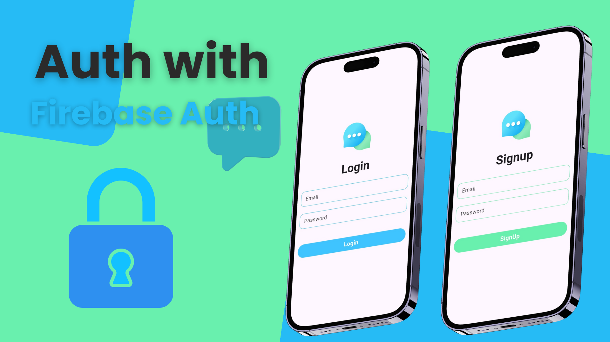
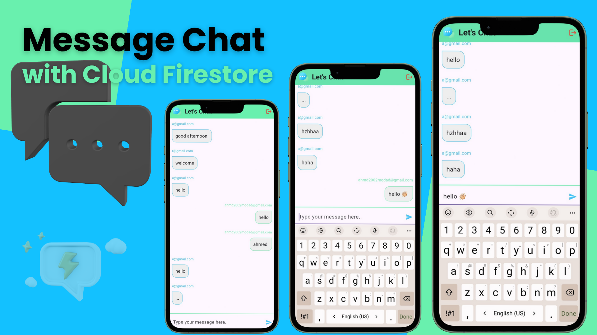

# 📱 Chat App

A cross-platform real-time messaging application built with Flutter and Firebase. Designed for simplicity, speed, and scalability, this app delivers a seamless chat experience across Android, iOS, Web, Windows, and macOS.

---

## 🚀 Project Overview

Chat App is a modern Flutter-based messaging platform that allows users to register, log in, and communicate instantly. It uses Firebase Authentication and Firestore for secure and scalable backend services. The UI is clean and responsive, optimized for both mobile and desktop environments.

---

## 🛠️ Tech Stack

- **Framework**: Flutter 3.8.1
- **Language**: Dart
- **Backend**: Firebase (Authentication, Firestore)
- **IDE**: Android Studio / VS Code
- **Linting**: `flutter_lints` package
- **Platforms Supported**: Android, iOS, Web, Windows, macOS

---

## 🧱 Architecture

- **Modular Screens**: Each screen (Login, Signup, Chat, Welcome) is separated for clarity and maintainability.
- **Reusable Widgets**: Custom components like `CustomPrimaryButton` and `CustomTxtField` enhance UI consistency.
- **Routing**: Managed via named routes and `MaterialPageRoute`.
- **Firebase Initialization**: Centralized in `firebase_options.dart` using `DefaultFirebaseOptions.currentPlatform`.

---

## ✨ Features

- 🔐 Firebase Email/Password Authentication
- 💬 Real-time chat using Cloud Firestore
- 📱 Responsive UI for multiple platforms
- 🎨 Custom splash and launch screens
- 📁 Asset management for icons and images
- 🔄 Hot reload support for fast development

---

## 🚀 How to Run the Project

1. **Clone the repository**  
- git clone https://github.com/a7med2002/my_chat_app.git

2. **Install dependencies** 
- flutter pub get

3. **Run the app**
- flutter run

---

## 🖼️ Screenshots

---

## 📦 Download APK  

You can download the latest version of the **Chat App** APK directly from Google Drive:  

👉 [**Download Chat App (APK)**](https://drive.google.com/file/d/1CPLAd2hprzHhStE3YhAU6WxUo7W5YPB5/view?usp=sharing)  

---

## 🌐 Social Links
- 👨‍💻 Developer: [ِAhmed Meqdad]
- 📧 Email: [ahmd2002mqdad@gamil.com]
- 💼 LinkedIn: [linkedin.com/in/ahmed-meqdad](https://www.linkedin.com/in/ahmedmeqdad0)